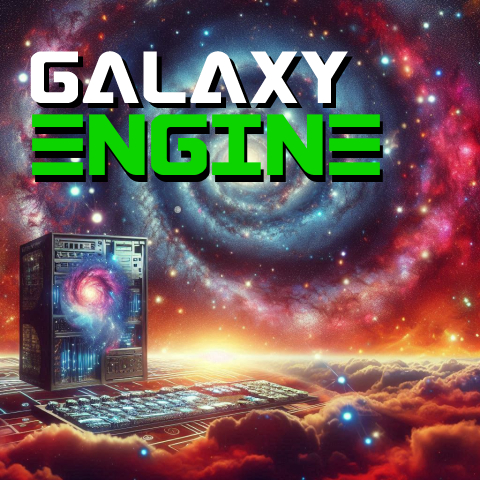

# GalaxyEngine - A simple 3D game engine using LISP as its scripting language

## Introduction

GalaxyEngine is an open source 3D game engine that uses LISP as its native scripting language.

The purpose of GalaxyEngine is to allow development of simple 3D games using an easy-to-use integrated development environment where everything is easily customizable.

## Building and running GalaxyEngine

Right now, GalaxyEngine only runs on macOS. However, the code is portable across three platforms: macOS, Windows, and Linux.

This is because GalaxyEngine is written in C++ and uses the Vulkan 3D graphics API and the glfw windowing library. Both of these are available across all three platforms.

Stay tuned for updates as they become available!

### Requirements

* Currently, an Apple computer running macOS
* The Vulkan 3D SDK
* The glfw windowing library
* The glm matrix math library

### Building

* Stay tuned!

### Running

* Stay tuned!

## Using GalaxyEngine

GalaxyEngine is a work in progress. Please check back for further updates.

## Version

Current version: 0.05 August 29, 2024 - Initializes blank glfw window at 1200 x 600, initializes Vulkan layer, and selects the first physical GPU device to use, initializes Logical Device on top of it, creates draw surface to connect Vulkan with glfw window. That's it!

